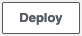
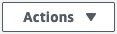

# AWS Lambda Function With HTTP Trigger

> Hands-on Lab

|                   |                       |
| :---------------- | :-------------------- |
| Cloud Vendor      | **Amazon AWS**   |
| Proficiency Level | **Cloud  Enthusiast** |
| Tags              |   |

## Lab Scenario
In this lab, you will create a serverless app using AWS Lambda. The serverless app will use an HTTP trigger and will be publicly accessible via its URL. When invoked, the app will reply with the phrase: `“Hello, [your_name]! I am a serverless app!”`, where `[your_name]` will be replaced with the name you pass as a query string parameter to the app.

Each exercise below builds upon the previous one. You should start each new exercise from the last step of the previous exercise unless it is explicitly written otherwise.

## What will you learn in this lab?
After completion of this lab, you will be able to:

- Create AWS Lambda serverless apps
- Use HTTP to trigger the execution of your serverless app
- Modify the code of the serverless app to reply with the intended message

## Prerequisites
To complete this lab, you will need the following:

- Reliable internet connection
- AWS account used to access Amazon AWS Management Console

## Lab Instructions

### Exercise #1: Create an AWS Lambda Function

In this exercise, you will create an AWS Lambda Function for your serverless app.

1. Sign into the AWS Management console at [https://aws.amazon.com/console/](https://aws.amazon.com/console/) using your AWS credentials.
2. In the search box on top of the screen, type *Lambda* and press *Enter*.
3. Click on *Lambda* from the list of *Services*.
4. On the new page, click on the .
5. On the *Create function* screen, select *Author from scratch*.
6. On the same screen, fill in the following information:
   - *Function name* → `[initials]-awslbdhttplab-fun`
   - *Runtime* → `Node.js 14.x`
7. Click on the  button.

#### Exercise Summary
At this point, you have learned how to create an AWS Lambda Function that you can use for your serverless app.

### Exercise #2: Add an HTTP Trigger to the Lambda Function

In this exercise, you will add an HTTP trigger to use with your AWS Lambda Function. You will test the trigger by loading the endpoint URL into your browser.

1. On the function page, in the *Function overview* section, click on the  button.
2. On the *Add trigger* page, click on the *Trigger configuration* dropdown and select `API Gateway`.
3. In the form, select the following information:
   - *API* → `Create a new API`
   - *API type* → `HTTP API`
   - *Security* → `Open`
4. Click on the  button to create the trigger.
5. Once the trigger is created, on the function page, click on the *API Gateway*.
6. Copy the *API endpoint* from the *Triggers* section on the *Configuration* tab.
7. Open a new browser window, paste the URL in the address bar and press *Enter*.

#### Exercise Summary
At this point, you have learned how to create an HTTP trigger for your AWS Lambda Function and test it with your browser.

### Exercise #3: Modify the AWS Lambda Function Code

In this exercise, you will modify the AWS Lambda Function Code to reply with `“Hello, [your_name]! I am a serverless app!”`, where `[your_name]` will be replaced with the name you pass as a query string parameter to the app. You will test the modification in your browser.

1. On the function page, switch to the *Code* tab.
2. In the code editor, in the *Code source* section, find the following line (line 5):
   ```
   body: JSON.stringify('Hello from Lambda!'),
   ```
3. Change the line to the following:
   ```
   body: JSON.stringify(`Hello, ${event["queryStringParameters"]["name"]}! I am a serverless app!`),
   ```
4. Click on the  button above the editor to deploy your changes.
5. Switch to the *Configuration* tab.
6. Copy the *API endpoint* from the *Triggers* section on the *Configuration tab.
7. Open a new browser window, paste the URL in the address bar.
8. Add the following at the end of the URL:
   ```
   ?name=[your_name]
   ```
   
   where `[your_name]` is your name, and press *Enter*.

#### Exercise Summary
At this point, you have learned how to modify the code for Azure Function with HTTP trigger and test your changes.

### Exercise #4: Delete the AWS Lambda Function
In this exercise, you will delete the AWS Lambda Function and not incur any additional charges for it.

1. On the function page, click on the  button on top of the page.
2. Select the *Delete function* option from the dropdown.
3. Confirm the deletion by clicking on the  button.

#### Exercise Summary
At this point, you have learned how to delete the AWS Lambda Function to prevent unwanted use and save on cost.

## Help improve this lab

[](https://github.com/CrimsonPinnacle/cloud-labs/issues/new?assignees=toddysm&labels=new+lab&template=bug_template.md&title=) [](https://github.com/CrimsonPinnacle/cloud-labs/pulls)