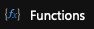
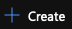
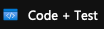
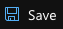

# Lab Title &middot;

> Hands-on Lab

|                   |                       |
| :---------------- | :-------------------- |
| Cloud Vendor      | **Microsoft Azure**   |
| Proficiency Level | **Cloud  Enthusiast** |
| Tags              |    |

## Lab Scenario
In this lab, you will create an Azure serverless app using Azure Functions. The serverless app will use an HTTP trigger and will be publicly accessible via its URL. When invoked, the app will reply with the phrase: `“Hello, [your_name]! I am a serverless app!”`, where `[your_name]` will be replaced with the name you pass as a query string parameter to the app.

Each exercise below builds upon the previous one. You should start each new exercise from the last step of the previous exercise unless it is explicitly written otherwise.

## What will you learn in this lab?
After completion of this lab, you will be able to:

- Create Azure serverless apps
- Use HTTP to trigger the execution of your serverless app
- Modify the code of the serverless app to reply with the intended message
- Stop the serverless app to avoid unwanted charges

## Prerequisites
To complete this lab, you will need the following:

- Reliable internet connection
- A work, school or personal Microsoft Account used to access Microsoft Azure Management Portal
- A subscription for Microsoft Azure

## Exercises

### Exercise #1: Create an Azure Function App Resource
In this exercise, you will create an Azure Function App Resource. Azure Functions are hosted within the App Service cloud service offered by Microsoft.

1. Sign into the Microsoft Azure Management Portal at [http://portal.azure.com](http://portal.azure.com) using your Microsoft Account.
2. Click on  in the upper left corner right under the Microsoft Azure logo.
3. In the search box search for *Function App*.
4. Select *Function App* from the list of results.
5. Click on the  button.
6. On the *Basics* tab in section, *Project Details* fill in the following information:
  - *Subscription* → `[select your Microsoft Azure subscription]`
  - *Resource group* → Click on  `Create new`
  - *Name* (the text field in the pop up) → `azfunhttplab-[initials]-rg`, where `[initials]` are your first, middle, and last name initials
7. On the *Basics* tab in section, *Instance Details* fill in the following information:
  - *Function App name* → `azfunhttplab-[initials]-fun`
  - *Runtime stack* → `.NET`
  - *Version* → `3.1`
  - *Region* → `West US 2`
8. Click on the  button.
9. On the *Hosting* tab, leave the default selections.
10. Click on the  button.
11. On the *Monitoring* tab, leave the default selections.
12. Click on the  button.
13. On the *Tags* tab, add the following tags:
  - *Role* → `http serverless`
  - *Lab* → `azfunhttplab`
  - *Owner* → `[your full name]`
  - *OwnerEmail* → `[your email address]`
14. Click on the  button.
15. Review the summary and click on the  button.
16. Wait until the deployment is completed.
17. Once the deployment is complete, click on the  button in the left-hand menu list under the Microsoft Azure logo.
24. Find the `azfunhttplab-[initials]-rg` resource group in the list and click on it.
25. Verify the following resource types exist:
  - `App Service plan`
  - `Function App`
  - `Application Insights`
  - `Storage account`

#### Exercise Summary
At this point, you have learned how to create a serverless app in Microsoft Azure using Azure Function App. Note that although you requested the creation of a single resource, multiple were created. 

### Exercise #2: Create an Azure Function
In this exercise, you will create an Azure Function. Azure Function is the serverless service offered by Microsoft.

1. Click on the `azfunhttplab-[initials]-fun` App Service resource.
2. In the second left-hand navigation, in section *Functions*, click on the  button.
3. Click on the  button.
4. In the *Create function* blade, select the following:
   - *Development environment* → `Develop in portal`
   - *Template* → `HTTP trigger`
   - *New Function* → `HttpTriggerFunction`
   - *Authorization level* → `Anonymous`
5. Click on the 

#### Exercise Summary
At this point, you have learned how to create an Azure Function with HTTP trigger in your Azure Function App. You can create multiple functions in the same App, each with different triggers.

### Exercise #3: Modify the Function Code and Test the App
In this exercise, you will modify the Function code to reply with `“Hello, [your_name]! I am a serverless app!”`, where `[your_name]` will be replaced with the name you pass as a query string parameter to the app and test the app.

1. In the second left-hand navigation, in section *Developer*, click on the  button.
2. In the code editor field, find the following line (line 20): 
   ```
   : $"Hello, {name}. This HTTP triggered function executed successfully.";
   ```
3. Change the line to the following:
   ```
   : $"Hello, {name}. I am a serverless app!";
   ```
4. Click on the  button.
5. Click on the  button.
6. Copy the URL from the pop-up, and open a new browser window or tab.
7. Paste the URL in the browser’s address field and add the following to the end:
   ```
   ?name=[your_name]
   ```
   where `[your_name]` is your name. 
8. Press *Enter*. The desired text will appear in the browser window.

#### Exercise Summary
At this point, you have learned how to modify the code for Azure Function with HTTP trigger and test your changes.

## Help improve this lab

[](https://github.com/CrimsonPinnacle/cloud-labs/issues/new?assignees=toddysm&labels=new+lab&template=bug_template.md&title=) [](https://github.com/CrimsonPinnacle/cloud-labs/pulls)