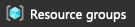
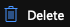

# Creating Virtual Network And Subnets In Azure

> Hands-on Lab

|                   |                       |
| :---------------- | :-------------------- |
| Cloud Vendor      | **Microsoft Azure**   |
| Proficiency Level | **Cloud Enthusiast**  |
| Tags              |   |

## Lab Scenario
In this lab, you will provision a Virtual Network with two subnets in Microsoft Azure.

Each exercise below builds upon the previous one. You should start each new exercise from the last step of the previous exercise unless it is explicitly written otherwise.

## What will you learn in this lab?
After completion of this lab, you will be able to:

- Provision a Virtual Network in Microsoft Azure.
- Create subnets in the newly created Virtual Network.

## Prerequisites
To complete this lab, you will need the following:

- Reliable internet connection.
- A work, school or personal Microsoft Account used to access Microsoft Azure Management Portal.
- A subscription for Microsoft Azure.

## Exercises

### Exercise #1: Provision a Virtual Network in Microsoft Azure

In this exercise, you will provision a virtual network with a two subnets (`public` and `private`) in Microsoft Azure.

1. Sign into the Microsoft Azure Management Portal at [http://portal.azure.com](http://portal.azure.com) using your Microsoft Account.
2. Click on  in the upper left corner right under the Microsoft Azure logo.
3. In the search box search for *Virtual network*.
4. Select *Virtual network* from the list of results.
5. Click on the  button.
6. On the *Basics* tab in section, *Project Details* fill in the following information:
  - *Subscription* → `[select your Microsoft Azure subscription]`
  - *Resource group* → Click on `Create new`
  - *Name* (the text field in the pop up) → `aznetworkinglab-[initials]-rg`, where `[initials]` are your first, middle, and last name initials
7. On the *Basics* tab in section, *Instance Details* fill in the following information:
  - *Name* → `aznetworkinglab-[initials]-vnet`
  - *Region* → `West US 2`
8. Click on the  button.
9. Click on the  button.
10. Fill in the following information:
    - *Subnet name* → `public`
    - *Subnet address range* → `10.0.1.0/24`
11. Click on the  button.
12. Click on the  button.
13. Fill in the following information:
    - *Subnet name* → `private`
    - *Subnet address range* → `10.0.2.0/24`
14. Select the `default` subnet from the list.
15. Click on the  button.
16. Click on the  button.
17. Leave all selection as by default.
18. Click on the  button.
  - *Role* → `virtual network`
  - *Lab* → `aznetworkinglab`
  - *Owner* → `[your full name]`
  - *OwnerEmail* → `[your email address]`
14. Click on the  button.
15. Review the summary and click on the  button.
16. Wait until the deployment is completed.
17. Once the deployment is complete, click on the  button in the left-hand menu list under the Microsoft Azure logo.
24. Find the `aznetworkinglab-[initials]-rg` resource group in the list and click on it.
25. Verify the following resource types exist:
    - `Virtual network`

#### Exercise Summary

At this point, you have learned how to provision a virtual network in Microsoft Azure.

### Exercise #2: Delete the Virtual Network

In this exercise you will learn how to delete the virtual network to avoid additional charges while not using it.

1. Click on the `aznetworkinglab-[initials]-vnet` virtual vetwork resource.
2. Click on the  button.
3. Confirm the deletion of the virtual network resource.

#### Exercise Summary

At this point, you have learned how to delete the virtual network resource and save on cost.

## Help improve this lab

 