# Creating A Static Website In Azure Storage

> Hands-on Lab

|                   |                       |
| :---------------- | :-------------------- |
| Cloud Vendor      | **Microsoft Azure**   |
| Proficiency Level | **Cloud  Enthusiast** |
| Tags              |    |

## Lab Scenario

In this lab, you will provision a Microsoft Azure Storage account and create a static website in it. You will upload static web pages and images to the storage blob that is used for the static web site and will test that the content is served properly.

Each exercise below builds upon the previous one. You should start each new exercise from the last step of the previous exercise unless it is explicitly written otherwise.

## What will you learn in this lab?

After completion of this lab, you will be able to:

- Provision an Azure Storage Account
- Create a static website in the newly provisioned Azure Storage Account
- Upload content to the static website
- Test the static web site
- Delete the Storage account

## Prerequisites

To complete this lab, you will need the following:

- Reliable internet connection
- A work, school or personal Microsoft Account used to access Microsoft Azure Management Portal
- A subscription for Microsoft Azure

## Lab Instructions

### Exercise #1: Creating Azure Storage Account

In this exercise, you will provision a Microsoft Azure Storage Account.

1. Sign into the Microsoft Azure Management Portal at [http://portal.azure.com](http://portal.azure.com) using your Microsoft Account.
2. Click on  in the upper left corner right under the Microsoft Azure logo.
3. In the search box search for *Storage account*.
4. Select *Storage account* from the list of results.
5. Click on the 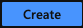 button.
6. On the *Basics* tab in section, *Project Details* fill in the following information:
  - *Subscription* → `[select your Microsoft Azure subscription]`
  - *Resource group* → Click on `Create new`
  - *Name* (the text field in the pop up) → `azstoragesitelab-[initials]-rg`, where `[initials]` are your first, middle, and last name initials
7. On the *Basics* tab in section, *Instance Details* fill in the following information:
  - *Storage account name* → `[initials]azstrsitelablab01str`, where `[initials]` are your first, middle, and last name initials
  - *Region* → `West US 2`
  - *Performance* → `Standard`
  - *Replication* → `Locally-redundant storage (LRS)`
8. Click on the 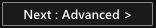 button.
9. On the *Advanced* tab, leave the default selections.
10. Click on the 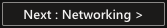 button.
11. On the *Networking* tab, leave the default selections.
12. Click on the 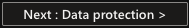 button.
13. On the *Data protection* tab, leave everything as default.
14. Click on the ![Next: Tags button] button.
15. On the *Tags* tab, add the following tags:
  - *Role* → `static web`
  - *Lab* → `azstoragesitelab`
  - *Owner* → `[your name]`
  - *OwnerEmail* → `[your email]`
16. Click on the 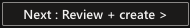 button.
17. Review the summary and click on the  button.
16. Wait until the deployment is completed.
17. Once the deployment is complete, click on the  button in the left-hand menu list under the Microsoft Azure logo.
24. Find the `azstoragesitelab-[initials]-rg` resource group in the list and click on it.
25. Verify the following resource types exist:
  - `Storage account`

#### Exercise Summary

At this point, you have learned how to provision a Storage Account in Microsoft Azure.

### Exercise #2: Create a Static Website in Azure Storage Account

In this exercise, you will create a Storage Blob Container that you can use to host a static web site.

1. Click on the `[initials]azstrsitelablab01str` Storage Account resource.
2. In the second left-hand navigation, in section *Data management*, click on the 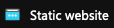 button.
3. On the *Static website* blade, change the *Static website* toggle button to `Enabled`.
4. Fill in the following information in the form that appears:
  - *Index document name* → `index.html`
  - *Error document path* → `error.html`
5. Click on the 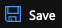 button.
6. Copy the *Primary endpoint* URL.
7. Open a new browser window, paste the copied URL into the address bar and press *Enter*.

#### Exercise Summary

At this point, you have learned how to access the static web site you created in your Storage Account by using your browser.

### Exercise #3: Upload Content to the Static Website in Azure Storage Account

In this exercise, you will upload content to the static website.

1. Create a new file on your local machine with name `index.html` and the following content:
   ```
    <!DOCTYPE html>
    <html>
        <head>
            <title>Welcome to Azure Storage</title>
        </head>
        <body>
            <h1>My Static Website</h1>
            <p>Hello, I am a static web site hosted in Azure Storage Blob.</p>
        </body>
    </html>
   ```
2. Create a new file on your local machine with name `error.html` and the following content:
   ```
    <!DOCTYPE html>
    <html>
        <head>
            <title>Ooops... error!</title>
        </head>
        <body>
            <h1>An error occured</h1>
            <p>Ooops, it seems that we encountered an error or you are trying to access the wrong page.</p>
        </body>
    </html>
   ```
3. Take a screenshot of the text editor you used to create the above two files and save it on your local machine with the following name `ide-screenshot.png`.
4. In the second left-hand navigation, in section *Data storage*, click on the 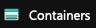 button.
5. Click on the `$web` container.
6. Click on the 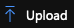 button on top of the blade.
7. Select the `index.html`, `error.html`, and `ide-screenshot.png` files from your local machine and click on the 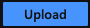 button.
15. Reload the URL from step 7 in exercise 2.
16. Add the following `/foo` to the end of the URL in your browser’s address bar and press *Enter*.
17. Remove the `/foo` from the URL in your browser’s address bar and add the following `/ide-screenshot.png`.
18. Press *Enter*.

#### Exercise Summary

At this point, you have learned how to access the home page of the static web site you created in your Azure Storage account. You have also learned how the static web site you created in your Azure Storage handles errors and binary content like images.

### Exercise #4: Delete the Azure Storage Account

In this exercise, you will delete the Azure Storage Account to save costs.

1. Click on the `[initials]azstrsitelablab01str` in the breadcrumbs on top of the page.
2. In the second left-hand navigation, click on the 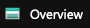 button.
3. Click on the 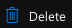 button on top of the page.
4. Type the name of the Storage Account in the field and click on the 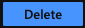 button.
 
#### Exercise Summary

At this point, you have learned how to delete your Storage Account to save cost.

## Help improve this lab

[](https://github.com/CrimsonPinnacle/cloud-labs/issues/new?assignees=toddysm&labels=new+lab&template=bug_template.md&title=) [](https://github.com/CrimsonPinnacle/cloud-labs/pulls)